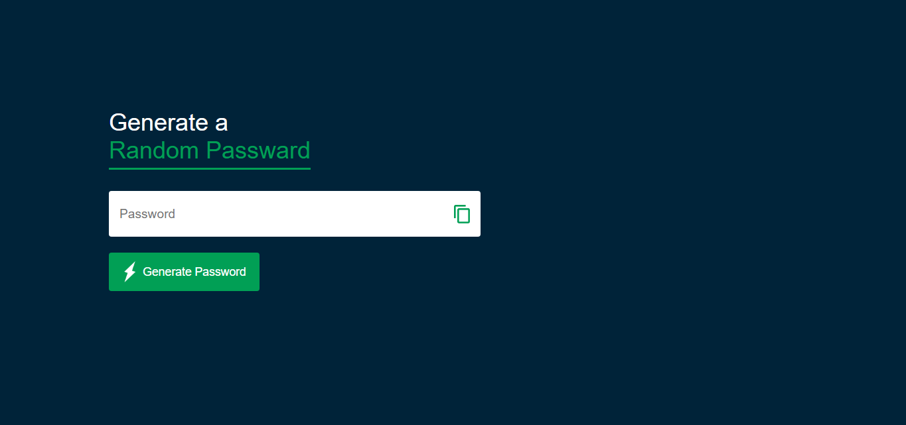

# 🔐 Random Password Generator

This is a simple web-based Random Password Generator built using **HTML**, **CSS**, and **JavaScript**.  
It allows users to generate strong, secure, and customizable passwords with a single click.

## 🚀 Features

- Generate random passwords instantly
- Adjustable password length
- Includes uppercase, lowercase, numbers, and symbols
- Clean and responsive user interface

- 
## 🖥️ Preview




## 🛠️ Tech Used

- HTML5
- CSS3
- JavaScript (Vanilla)

## 📦 How to Use

1. Clone the repo or download the ZIP:
   ```bash
   git clone https://github.com/yourusername/random-password-generator.git
